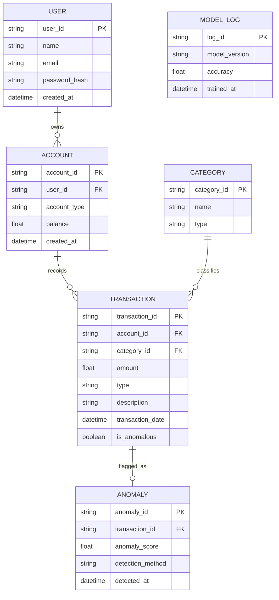

```mermaid
erDiagram

    USER {
        string user_id PK
        string name
        string email
        string password_hash
        datetime created_at
    }

    ACCOUNT {
        string account_id PK
        string user_id FK
        string account_type
        float balance
        datetime created_at
    }

    TRANSACTION {
        string transaction_id PK
        string account_id FK
        string category_id FK
        float amount
        string type
        string description
        datetime transaction_date
        boolean is_anomalous
    }

    CATEGORY {
        string category_id PK
        string name
        string type
    }

    ANOMALY {
        string anomaly_id PK
        string transaction_id FK
        float anomaly_score
        string detection_method
        datetime detected_at
    }

    MODEL_LOG {
        string log_id PK
        string model_version
        float accuracy
        datetime trained_at
    }

    USER ||--o{ ACCOUNT : owns
    ACCOUNT ||--o{ TRANSACTION : records
    CATEGORY ||--o{ TRANSACTION : classifies
    TRANSACTION ||--o| ANOMALY : flagged_as
```